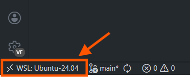

## Project Environment Setup (Linux (or WSL) / macOS)

WARNING: Windows is not currently supported.

### Part 1 - System Prerequisite Setup

### 0.0) Install WSL2 + Ubuntu 24.04 (Windows)

1) Open **PowerShell (Admin)** and run:

```powershell
wsl --install
```

- If you want to explicitly install **Ubuntu 24.04 LTS** (recommended), first list available distros:

```powershell
wsl --list --online
```

Then install Ubuntu 24.04:

```powershell
wsl --install -d Ubuntu-24.04
```

2) Reboot Windows if prompted.

3) Launch **Ubuntu 24.04** from the Start Menu once, then finish the first-time setup (create username/password).

(Optional) Update WSL:

```powershell
wsl --update
```

(Optional) Confirm you are using WSL2:

```powershell
wsl -l -v
```

### 0.1) Get comfortable using the command line

To see which folder you are in:
```bash
pwd
```
To list the files and directories in the current folder:
```bash
ls -l
```

To create a directory:
```bash
mkdir directory_name
```

To change your current directory:
```bash
cd directory_name
```

### 0.2) Install Git

For Ubuntu (including WSL), use the terminal:

```bash
sudo apt update
sudo apt install -y git-all
git --version
```

For macOS:

```
/bin/bash -c "$(curl -fsSL https://raw.githubusercontent.com/Homebrew/install/HEAD/install.sh)"
brew install git
```

### 0.3) Set up Git 

Set your Git identity:

```bash
git config --global user.name "Your Name"
git config --global user.email "you@example.com"
```
Set these to the same credentials used for your GitHub account.

It is strongly recommended that you learn the basics of the Git command line, especially `add`, `commit`, `push`, and `pull`.

### 0.4) Install Python venv
```bash
sudo apt-get update
sudo apt-get install libpython3-dev
sudo apt-get install python3-venv
```

### 0.5) Clone this project repo into a folder

```bash
mkdir Logisynth #Can be any name of your choice
cd Logisynth
git clone https://github.com/Sheffield-Chip-Design-Team/logisynth-venv.git
cd logisynth-venv
```

### 0.6) Install OSS CAD Suite, sv2v, and netlistsvg

This template uses OSS CAD Suite for the core hardware design tools. It includes Verilator, Icarus Verilog, Yosys, and related utilities in one installation.

Run the cross-platform installer script:

```bash
./scripts/install_oss_cad_suite.sh
```

If the script is not executable, run:

```bash
chmod +x ./scripts/install_oss_cad_suite.sh
./scripts/install_oss_cad_suite.sh
```

The script installs OSS CAD Suite system-wide and also installs `sv2v` and `netlistsvg`.

The installer is interactive:

- it checks whether each component appears to be already installed
- it shows where existing commands are found
- it asks whether to install or skip each component (`y/n`)

If you run inside Docker as `root`, make sure `sudo` is available in the image, or run on a host where `sudo` is installed.

Verify:

```bash
verilator --version
iverilog -V
vvp -V
yosys --version
sv2v --version
netlistsvg --help
```

Each command should print version information or an installation path.

### Part 2 - Project Environment Setup

### 1) Create and activate a Python virtual environment (venv)
Then create the virtual environment. This keeps this project isolated from other projects:
```bash
python3 -m venv .venv
```
To use the virtual environment, activate it. Do this every time you start a new terminal:
```bash
source .venv/bin/activate
```
If you do not activate the virtual environment, you may accidentally use the system-wide Python environment instead.

Note:
If you move to a different project, make sure you activate that project's virtual environment instead.
First deactivate the current one:
```bash
deactivate
```
Then run the same `source` command for the new project's virtual environment.

### 2) Run environment checks

```bash
./scripts/env_check.sh
```

### 3) Install Coraltb
```bash
./scripts/install_coraltb.sh
```

### 4) Create Workspace
```bash
./scripts/create_workspace.sh
```
## Notes
All of the checks should appear as `[OK]`. If anything fails, retrace your steps or ask for help.

- If you are using VS Code Remote (WSL), it may inject this project's `venv/bin` into `PATH`. This is normal, but if you suspect a path issue, check the active tools with:

  ```bash
  which python3
  which cocotb-config
  ```

  These commands help you confirm which Python environment is active.
### 5) VS Code with WSL

If you are using WSL, open the project from VS Code and install this extension first:


Then click the button in the bottom-left corner to open a remote WSL session:




You can now use VS Code inside WSL.

You will also need a Verilog linter extension. The current recommended one is:


After installing it, open the extension settings and go to the linting section.

### Note for native Ubuntu users

If you are already using Ubuntu 24.04 on a native machine, skip the WSL steps and start from section 0.1.

